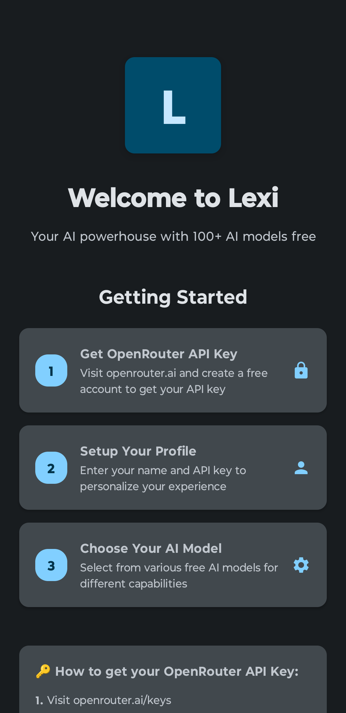
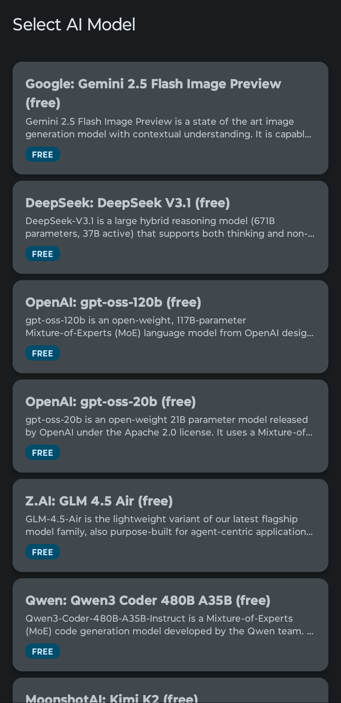
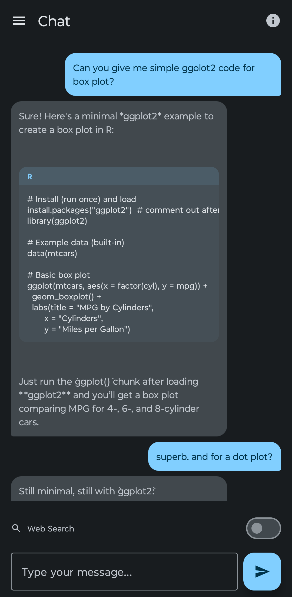
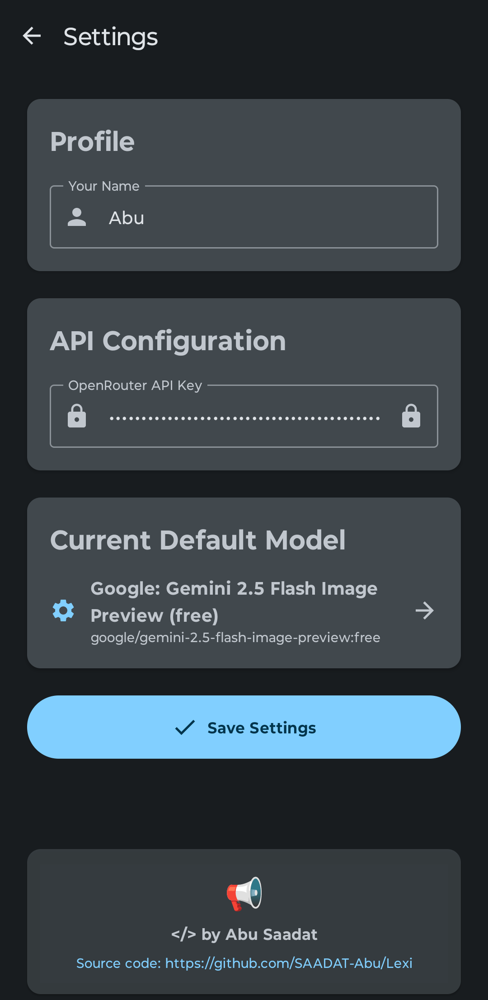

# 🤖 Lexi - Your AI Powerhouse

**Lexi** is a beautiful, modern Android app that provides seamless access to 100+ AI models through OpenRouter. With an intuitive interface, smart features, and developer-friendly tools, Lexi makes AI conversations accessible and delightful for everyone.

## 📱 Screenshots

<p align="center">
  
   
  
  
</p>

## Features


### **AI Model Management**
- **100+ Free Models**: Automatically discovers and lists all free OpenRouter models
- **Default Model Persistence**: Selected model is saved and remembered across sessions
- **Model Information Dialogs**: "Know the Model" feature shows capabilities for Claude, GPT, Llama, Gemma, and more
- **Easy Model Switching**: Change default model directly from settings

### 💬 **Enhanced Chat Experience**
- **Beautiful Material Design 3**: Modern chat bubbles with user/assistant styling
- **Code Block Display**: Special rendering for code with syntax highlighting and language headers
- **Copy Functionality**: Long-press messages and code blocks to copy content
- **Chat History Management**: Full session persistence with resume functionality
- **Navigation Drawer**: Swipe access to chat history and settings
- **Real-time Responses**: Smooth, responsive chat experience with loading indicators

### **Security & Privacy**
- **Secure API Key Storage**: Encrypted local storage using DataStore
- **Input Validation**: Comprehensive validation and error handling

## Tech Stack

- **Language**: Kotlin
- **UI Framework**: Jetpack Compose with Material Design 3
- **Navigation**: Navigation Compose with type-safe routing
- **Network**: Retrofit + OkHttp with comprehensive error handling
- **Storage**: DataStore Preferences for secure local data
- **Architecture**: MVVM with StateFlow and Compose State
- **Threading**: Coroutines with proper Dispatchers.IO for network calls

## Getting Started

### Prerequisites
- Android Studio Arctic Fox or later
- Android SDK 24+ (Android 7.0+)
- OpenRouter API key (get one free at [openrouter.ai](https://openrouter.ai))

### Installation
1. Clone the repository
   ```bash
   git clone https://github.com/SAADAT-Abu/Lexi.git
   cd Lexi
   ```
2. Open in Android Studio
3. Build and run the project
4. Get your free OpenRouter API key from [openrouter.ai](https://openrouter.ai)
5. Follow the in-app setup process

## Contributing

Contributions are welcome! Please feel free to submit a Pull Request.


## 🔗 Links

- **OpenRouter**: [openrouter.ai](https://openrouter.ai) - API provider for AI models
- **Issues**: Report bugs and request features on [GitHub Issues](https://github.com/SAADAT-Abu/Lexi/issues)

---

**⭐ Star this repo if you find Lexi useful!**
